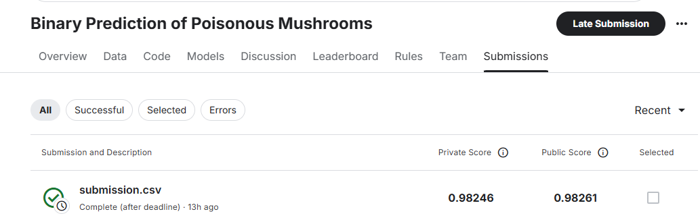

# Binary Classification with Random Forest

## About this project: 
- This project comes from the competition that i participated on Kaggle website. The details about the project is in [this link](https://www.kaggle.com/competitions/playground-series-s4e8).

- The main idea about this project is to predict whether a mushroom is edible or not based on physical characteristics.

## Used Python libraries - requirements of installation before running the notebook: 
1) Pandas 
- To read CSV files
- To deal with missing values
- To perform some DataFrame operations like "drop()", "select_dtypes()"

2) Seaborn/ Matplotlib
- To visualize the data.
- To customize the plot.

3) category_encoder
- Encoding categorical variables/ columns in dataframe because Machine Learning models require numerical inputs. 

4) Scikit-Learn
- To perform Random Forest model and evaluate it.

## The result for the project
- At the end of the project, a csv file which contains two columns "id" and "class"(filled with predictions from the model) must be exported and submitted to the competition. 
- The score obtained for this competition is the performance of the trained model to predict on more than 2 millions unseen mushrooms. 

